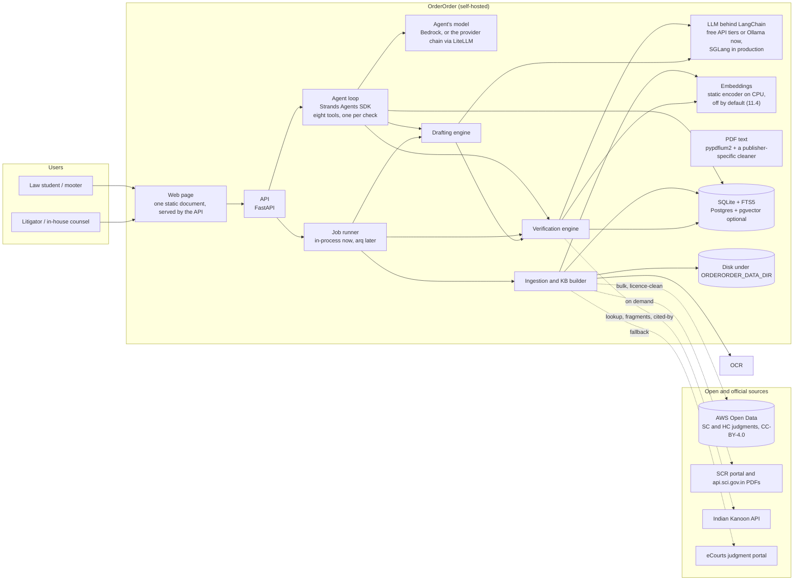
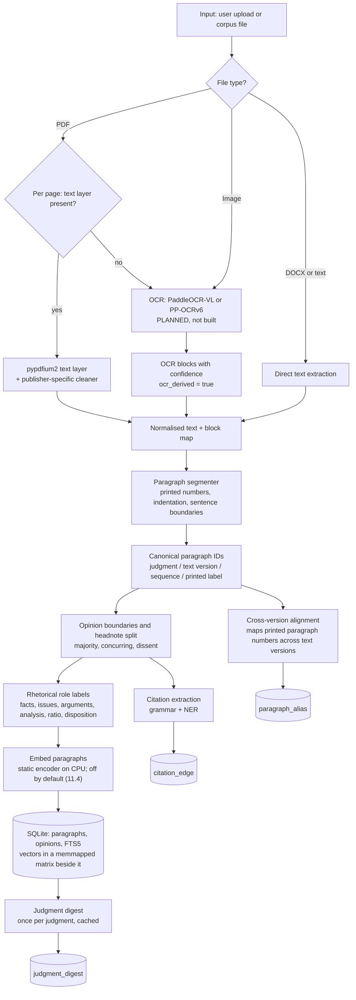
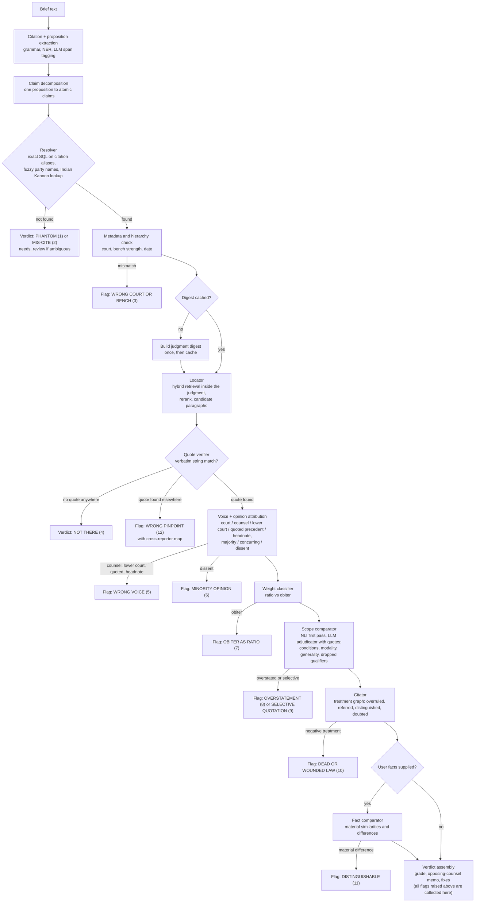
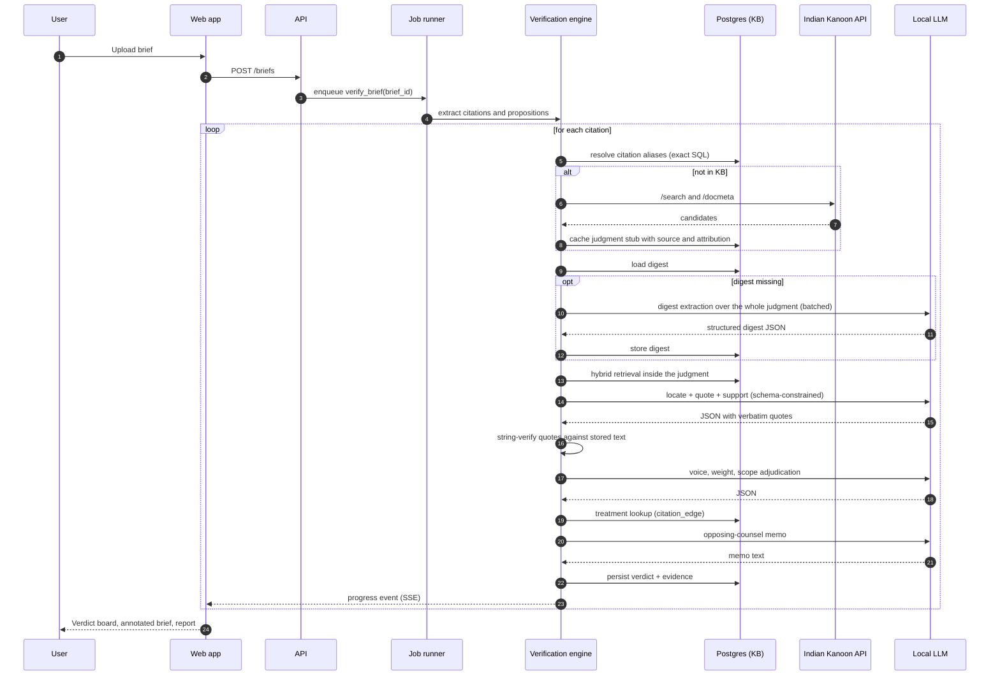
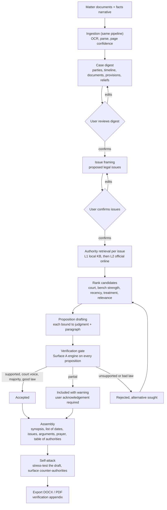
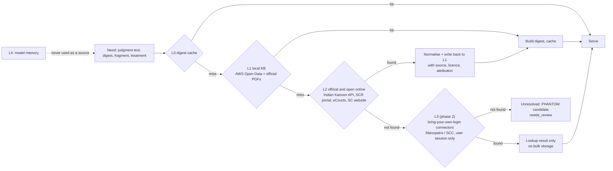
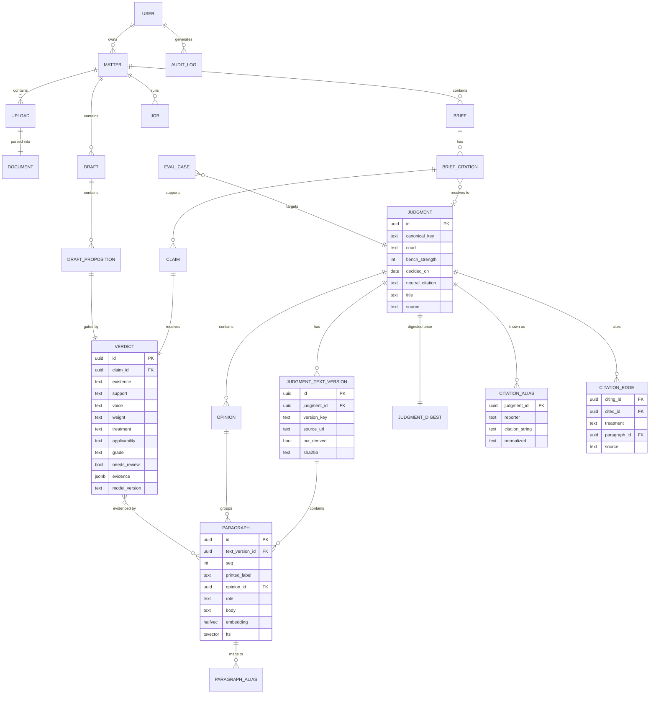
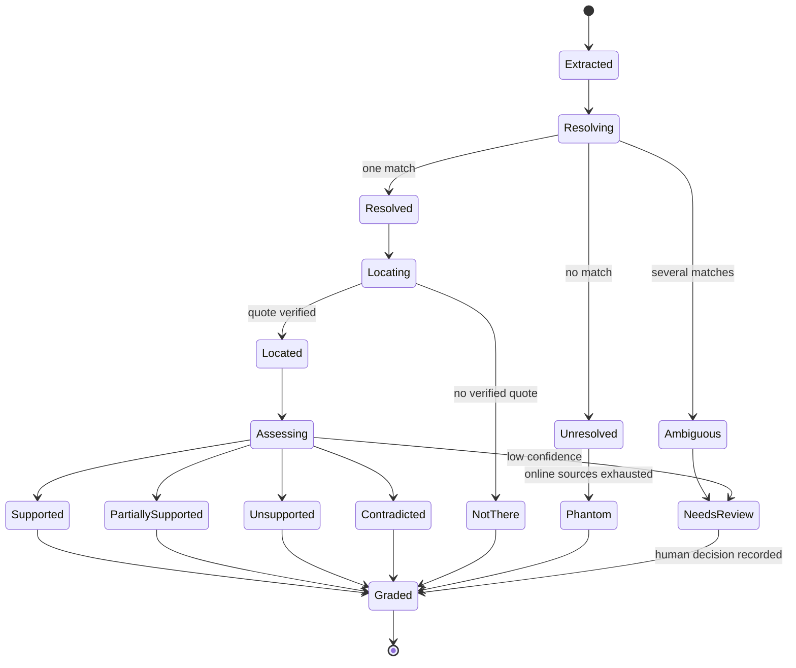
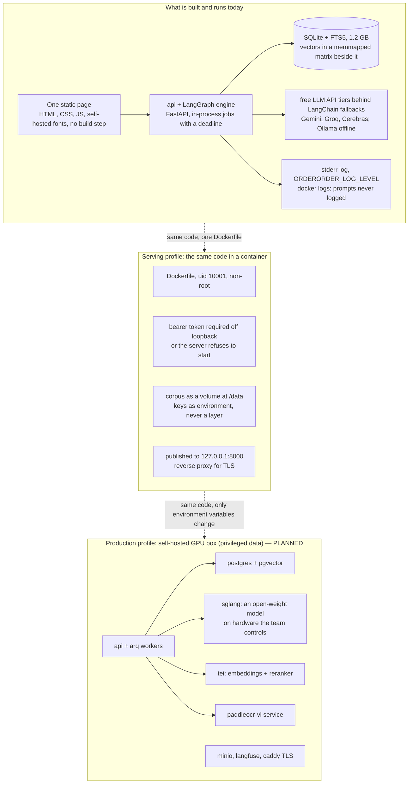
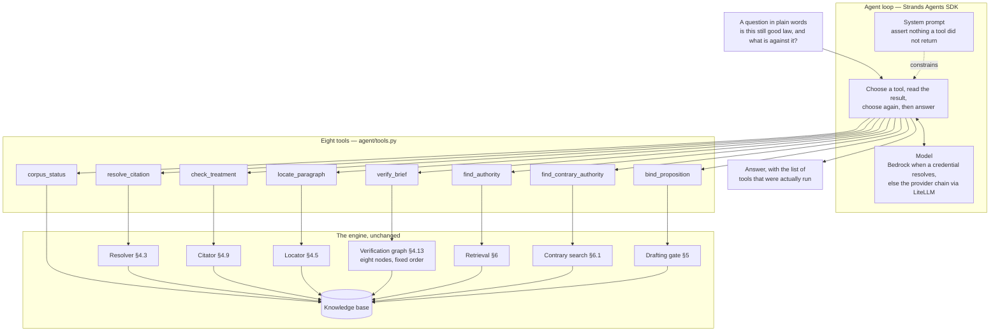

# OrderOrder — System Architecture

| | |
|---|---|
| **Version** | 0.2 |
| **Date** | 9 September 2026 (first written 4 September) |
| **Companion documents** | [PRD.md](PRD.md) · [TECH_STACK.md](TECH_STACK.md) · [ROADMAP.md](ROADMAP.md) · [DEPLOYMENT.md](DEPLOYMENT.md) |

This document specifies how OrderOrder is built: the ingestion pipeline and knowledge base, the verification engine that checks one citation at a time, the drafting engine that reuses it, the retrieval hierarchy, the data model, the verdict schema, deployment, and the evaluation harness. Diagram numbers are referenced from the other documents.

**How to read it against the code.** Most of this specification is now built and measured; §11.4 is the
measurement and it is the section to trust when the two disagree. Where a component was specified and
something else was built instead — the document parser, the embedding model, the database, the web
front end — the section says so in terms rather than being quietly amended, because the reason a
design was abandoned is worth more than the design was. Sections still describing a target rather than
an artefact are marked **planned**. [DEPLOYMENT.md](DEPLOYMENT.md) is the operational counterpart: what
is ready, what will stop you, and the security posture item by item.

---

## 1. From principles to mechanisms

| Principle ([PRD](PRD.md) §5) | Mechanism |
|---|---|
| Quote-or-nothing | A `QuoteVerifier` string-matches every quote the model returns against the stored paragraph text. A verdict with `support` of `full` or `partial` and no verified quote fails validation and cannot be persisted (application check plus a database constraint). |
| Closed world | Prompts contain only retrieved paragraphs and digests. The resolver, not the model, decides which judgment a citation refers to. Prompts require the answer `not_found` when the supplied text does not contain the claim. |
| Three verdicts | Existence, location and support are separate pipeline stages with separate typed results and separate gold labels. |
| Adversarial | The memo prompt is written as opposing counsel's instructions; the grading rubric rewards weaknesses found. |
| Lawyer decides | No stage has side effects outside OrderOrder's own store; every export carries the disclaimer and the model version. |
| Auditable | Each verdict stores paragraph IDs, text version, quotes with offsets, source URL, retrieval trace, model and prompt version. |
| Temperature is not safety | Sampling is configuration. Correctness comes from retrieval quality, string verification and schema-constrained decoding. |
| Abstain | Every stage returns a typed result that includes `needs_review` with a reason code; the UI shows it as a first-class state. |

The engine is **deterministic code with language-model calls at the leaves**, not an autonomous agent. It is implemented as a LangGraph state graph (§4.13): each stage is a typed Python node, each decision is a conditional edge, and the verdict-in-progress is the graph state. Every LLM call goes through LangChain's model interface with a Pydantic output schema (`with_structured_output`), a prompt version and a logged trace; no node runs a ReAct-style tool loop.

---

## 2. System context



**Diagram 1.** Users reach the web app; the API enqueues work; workers run the three engines against the local knowledge base, the local LLM and the embedding service. External sources are reached only by the ingestion and resolver components, and everything fetched is normalised into the local store. The agent loop is a second way in to the same engines and no more than that: it chooses which check to run and has no path to the knowledge base except through them (§15).

| Component | Responsibility | Package |
|---|---|---|
| Web page | Upload, verdict board, annotated brief, judgment viewer, authority search, drafting workspace, exports. One static HTML document with its own CSS and JS and no build step — see §10 | `web/static` |
| API | Bearer token ahead of every route, uploads, jobs, verdict and draft endpoints, server-sent progress events | `web/api.py` |
| Job runner | Long-running jobs: verification and drafting. An in-process registry with a deadline, not a table; ingestion and indexing are CLI commands. See [DEPLOYMENT.md](DEPLOYMENT.md) §2.3 | `web/jobs.py` |
| Ingestion and KB builder | Fetching, PDF text, cleaning, segmentation, opinions, aliases, embeddings, citation graph | `ingest/` |
| Verification engine | The per-citation pipeline (§4); pure Python, CLI-testable without the web app | `engine/` |
| Drafting engine | Case plan, propositions, gate, assembly, self-attack | `drafting/` |
| LLM | Reached only through LangChain's model interface, so the provider is configuration: free API tiers with fallbacks for the hackathon, Ollama for offline development, SGLang for production; structured output via `with_structured_output` | config |
| Embeddings | A static encoder (model2vec) in-process on CPU. Built and measured; **off by default**, now as a trade rather than a verdict — at one vote it buys five points on paraphrase recall and charges nine on fragments (§11.4). BGE-M3 on a GPU is the open experiment; the encoder is a flag and the store records which model wrote it | in-process |
| Vector store | A memmapped float16 matrix beside the database is what ranking reads. **Chroma is an optional second home for the same vectors** — an import, not a re-embedding — for queries from outside this process. Behind the `chroma` extra, which is a security decision (§3.7) | in-process |
| Rhetorical roles | A cue classifier over every stored paragraph, abstaining to `none`. Never a model | in-process |
| Reranker | **Not built.** `RERANKER_MODEL` is configured and nothing reads it. The measurement that would justify one is §11.4's third row, and it points at the encoder rather than at reranking | — |
| PDF text | pypdfium2 for the text layer, plus a cleaner specific to this publisher: margin letters, running headers, the editorial headnote, the coram, the editors' sign-off. Docling was specified and is not used — the official SCR PDFs are born-digital and the noise in them is publisher-specific rather than layout-general | in-process |
| OCR | **Not built.** A brief filed as a scan is reported as having no text layer rather than guessed at. §3.2 is the design, PP-OCRv6 and PaddleOCR-VL are still the choice, and nothing needs it until a scanned brief does | — |
| Database | System of record, full-text (FTS5), citation graph. **SQLite by default** — one file, 1.2 GB on the whole corpus. Postgres with pgvector is wired and optional, and is what the vector half would need at scale | file, or container |
| Object store | Original files, OCR output, rendered reports | MinIO or local disk |

---

## 3. Ingestion and knowledge-base build



**Diagram 2.** The same pipeline serves corpus building (AWS Open Data files, official PDFs) and user uploads (briefs, case documents). Routing is per page because Indian court PDFs are often hybrid: a typed order followed by scanned annexures.

### 3.1 Sources and text versions

A judgment can exist in several **text versions**: the AWS Open Data copy, the official PDF from `api.sci.gov.in`, an Indian Kanoon copy fetched on demand, a user-uploaded copy. Each version is stored separately with its source URL, licence, SHA-256 and an `ocr_derived` flag. The **official PDF is the preferred anchor** for pinpoints when available; otherwise the AWS Open Data copy. Verdicts always name the version they were resolved against.

Corpus build order for the hackathon: AWS Open Data Supreme Court parquet metadata first (fast, gives the citation alias table), then judgment text for the chosen year range, then official PDFs for judgments that appear in the demo memorial and the gold set.

### 3.2 Per-page routing — **planned**

The corpus is born-digital throughout, so nothing here has been needed yet and none of it is built: a
brief with no text layer is reported as such rather than guessed at. This is the design for when a
scanned brief arrives.

For each PDF page: extract the text layer; if characters per page are below a threshold (about 50-100) **and** image area covers most of the page, treat it as scanned. Also detect invisible OCR text layers (render mode 3) so that a previously OCR'd scan is not trusted blindly: re-OCR when the embedded layer's confidence is unknown and the page image is available.

### 3.3 Parsing

- **Born-digital pages**: the text layer through pypdfium2, then a cleaner written against this
  publisher. Docling was specified here and was not used, and the reason is worth recording: the
  official SCR PDFs are born-digital and uniform, so the problem was never layout analysis. It was
  that the page carries the *reporter's* words as well as the court's — margin letters, running
  headers, the citation line, the editorial headnote at the front and the editors' sign-off at the
  back — and a general layout model has no opinion about which of those is the judgment. Each kind of
  noise is a rule in `ingest/pdf.py`, and cutting the trailer alone took 424,000 characters of
  publisher's text out of judgments already stored. Docling returns if a source arrives whose problem
  actually is layout.
- **Scanned pages** — **planned**: PaddleOCR-VL-1.6 on GPU (109 languages including Hindi/Devanagari); PP-OCRv6 on CPU for the local path. Blocks carry per-line confidence. Pages under a confidence threshold are flagged for the user in the UI.
- **DOCX and pasted text**: direct extraction preserving paragraph breaks and footnotes.

### 3.4 Paragraph segmentation and canonical IDs

Judgments are segmented into paragraphs using printed paragraph numbers where present ("23.", "(23)", "Para 23"), indentation and blank-line structure otherwise, with sentence-boundary repair for OCR text. Each paragraph receives a **canonical ID** made of the judgment ID, the text-version key, a sequence number, and the printed label if any. Sequence numbers are stable within a version; printed labels are never assumed unique or contiguous.

A **cross-version alignment** step aligns paragraphs between versions of the same judgment (sentence-level fuzzy alignment) and writes `paragraph_alias` rows mapping printed labels across versions with a confidence score. This is how the viewer can say "para 23 in SCC numbering corresponds to para 19 in the official text" once the SCC numbering is known from a user's pinpoint or a later mapping source.

### 3.5 Opinion boundaries and headnotes

Rules first, model second:

- Author signatures ("...J.", "C.J.I.", "(Dissenting)", "I have had the advantage of reading the judgment of my learned brother") mark opinion starts.
- A judgment with one author is a single majority opinion; multiple authors produce majority, concurring and dissenting opinions, labelled by the disposition each reaches.
- Editorial headnotes (present in some copies, typically before "JUDGMENT" or containing "Held:" summaries) are split off and labelled `headnote`; they are never treated as the court's words.
- A local-LLM pass confirms the boundaries on judgments where rules are uncertain, with the result cached in the digest.

### 3.6 Rhetorical roles — **built, by cue rather than by model**

`ingest/roles.py`, run by `orderorder ingest mark-roles`. The design in 0.1 was a local LLM now and a
fine-tuned InLegalBERT later; what was built is neither, and the reason is the one that governs every
other classifier here. A model's label is an opinion about a paragraph that a reader cannot argue
with. A cue is a phrase in the judgment, so a disagreement is settleable by looking. The cue sets were
written against the wording of real Supreme Court judgments, and a paragraph matching nothing is
labelled `none` — the classifier abstains rather than guesses, exactly as `weight.py` does for ratio
versus obiter, and "List after four weeks." has no rhetorical role worth inventing.

Order matters and is explicit: the most specific wording wins. A paragraph that says both "learned
counsel for the appellant" and "placed reliance on" is counsel arguing, so argument is tried before
precedent; a paragraph that disposes of the appeal is a disposition whatever else it mentions, so that
is tried near the top. `preamble` is positional — it can only be the first paragraph.

Two properties worth keeping. The pass is **idempotent**: a paragraph that already carries a role is
left alone unless `--relabel`, so the better positional evidence that `mark-opinions` writes is not
overwritten by a weaker cue. And it **streams by text version**, holding a bounded working set against
a corpus of 700k paragraphs rather than loading them all.

What this does *not* change is voice (§4.6) and weight (§4.7). Those were built before roles existed
and still decide from structure and attributing cues directly, because they need to name the cue they
relied on.

**Retrieval reads them, in two ways, and only one is on.** For a day the labels were written and
nothing consumed them; `engine/search.py` now does.

- A **filter**, always available: `search_paragraphs(roles=[...])`, `orderorder find --role ratio`.
  Ask for the holding and the case history is not in the answer.
- A **boost**, opt-in: `--role-boost` adds a small prior to labelled holdings (`ratio` at 1.0,
  `precedent_relied` and `analysis` at 0.5) against a top fused relevance of about 16 — enough to
  break a near-tie, never enough to lift an irrelevant paragraph.

The boost is off by default because the measurement says it is a trade rather than a win:

| | baseline | + prior (all roles) | + prior (lift only) |
|---|---|---|---|
| verbatim @1 | 98% | 98% | 98% |
| fragment @1 | 85% | **93%** | 91% |
| paraphrase @1 | 25% | 16% | 19% |
| paraphrase @5 | 42% | 34% | 38% |

A remembered fragment gains six points; a restated idea loses six. The reason is worth keeping,
because it is not obvious: lifting every holding in the field lifts the *competitors* too, and a
paraphrase's own source paragraph is as often a recital of facts as a statement of law. So which
default is right depends on the question — "state the law" wants the boost, "find this passage" does
not — and that is the caller's to know rather than the engine's to assume.

This is the retrieval-side half of the correction `court_voice_only` makes on the way out (§11.4's
drafting table is why that filter exists at all). Voice and weight (§4.6, §4.7) remain independent of
roles: they decide from structure and attributing cues, because they have to name the cue they relied
on.

Each paragraph receives one of: `preamble`, `facts`, `lower_court`, `issues`, `argument_petitioner`, `argument_respondent`, `analysis`, `statute`, `precedent_relied`, `precedent_not_relied`, `ratio`, `disposition`, `none`. This is the OpenNyAI label set, chosen because `ratio`, `precedent_relied` and `precedent_not_relied` map directly onto the weight and voice checks.

- **Hackathon**: labels produced by the local LLM in batches of paragraphs with judgment context, schema-constrained, cached per judgment.
- **Phase 1**: a fine-tuned InLegalBERT classifier trained on the OpenNyAI rhetorical-role data plus LegalSeg, evaluated against the LLM labels and the gold set; the LLM stays as a fallback for low-confidence paragraphs.

### 3.7 Chunking and embeddings

The **paragraph is the chunk**. Each embedding input is the paragraph text prefixed with a short judgment context line (title, court, year, opinion type, role) so that paragraph vectors carry judgment-level meaning. Hybrid retrieval fuses the two rankings with reciprocal rank fusion. Citation strings are never looked up by vector search; they are exact-match SQL on the alias table.

**What was built instead of pgvector.** The corpus is one SQLite file, so the full-text half is an
FTS5 table and the dense half is a memory-mapped float16 matrix beside the database with a parallel
list of paragraph ids — 668,272 rows is a 340 MB matrix and a matrix multiply, and a vector service
to do that would have been a service to run. Float16 halves the file and changes no ranking, since
only the order of the scores matters. The `halfvec` and HNSW design in §7 is what the Postgres
profile uses and is what a corpus past this one needs; `DATABASE_URL` is the switch. Either way the
fusion seam is the same code, which is what let the encoder be measured rather than assumed
(§11.4).

**Chroma, as an optional second home for the same vectors** (`engine/chroma_store.py`,
`orderorder chroma-import` and `chroma-search`). Ranking still reads the memmap — that is the measured
answer and it does not change. What a database adds is a query surface for anything *outside* this
process: a dashboard, another service, an export, a metadata-filtered lookup the matrix cannot do. It
is an **import and not a re-embedding**, so the two backends cannot disagree with each other or with
the `paragraph` table, and the query is encoded by whatever encoded the corpus because the model name
is read back from the store's index — a mismatch would rank silently wrong and never announce itself.
It embeds in-process and persists to a directory; there is no server and telemetry is off.

It is an **optional extra, deliberately**: `uv sync --extra chroma`. `chromadb` 1.5.9 carries five
open advisories with **no fixed version published**, so it is kept out of the dependency set the CI
audit covers rather than shipped in it. That is the right call and it has a consequence worth stating
plainly: enabling the extra takes on unpatched vulnerabilities that the audit will not warn about,
because the audit no longer sees the package. Nothing web-facing touches it — both commands are CLI
only.

### 3.8 The judgment digest

Computed once per judgment, cached forever, versioned by prompt and model:

```json
{
  "judgment_id": "uuid",
  "text_version": "sci_pdf:2019-02-14:sha256:ab12...",
  "court": "Supreme Court of India",
  "bench_strength": 3,
  "judges": ["..."],
  "opinions": [
    {"id": "op1", "author": "...", "type": "majority", "paragraph_range": [1, 88]},
    {"id": "op2", "author": "...", "type": "dissenting", "paragraph_range": [89, 131]}
  ],
  "decided_on": "2019-02-14",
  "neutral_citation": "2019 INSC 123",
  "parallel_citations": ["(2019) 4 SCC 1", "AIR 2019 SC 999"],
  "facts_summary": "...",
  "procedural_history": "...",
  "issues": ["..."],
  "holdings": [
    {
      "proposition": "A misrepresentation vitiates consent only where it induced the contract.",
      "conditions": ["the misrepresentation induced the contract", "the representee relied on it"],
      "modality": "must",
      "paragraph_ids": ["v1:41", "v1:42"],
      "quote": "verbatim sentence from paragraph 41",
      "opinion_id": "op1",
      "weight": "ratio",
      "statutes": ["Indian Contract Act 1872, s. 17", "s. 19"]
    }
  ],
  "disposition": "Appeal allowed.",
  "statutes_considered": ["..."],
  "precedents_relied": [{"canonical_key": "...", "paragraph_ids": ["v1:30"]}],
  "precedents_distinguished": [],
  "headnote_present": true,
  "ocr_derived": false,
  "digest_model": "qwen3.5-27b-awq",
  "digest_prompt_version": "digest-v2"
}
```

Every holding in the digest is itself quote-grounded: the `quote` field must string-match the referenced paragraphs or the holding is dropped and the judgment marked for review. The digest is what makes the engine affordable: a 300-page judgment is read in full once, by batch, and every later citation of it starts from the digest.

### 3.9 Citation graph extraction

While ingesting each judgment, the citation grammar and the NER model extract every case citation inside it and the paragraph where it occurs. A treatment classifier (cue phrases first: "overruled", "no longer good law", "referred to a larger bench", "distinguished", "followed", "relied upon", "doubted"; local LLM for the rest) labels each edge. These `citation_edge` rows, merged with Indian Kanoon's cited-by lists fetched on demand, form the citator used by the treatment check.

---

## 4. Verification engine



**Diagram 3.** One citation's path through the engine. Numbers in parentheses are the failure modes from [PRD](PRD.md) §6. Flags hang off the stage that raises them and accumulate on the verdict; terminal verdicts (phantom, not there) short-circuit. Every stage may also emit `needs_review`.



**Diagram 4.** Runtime sequence for Surface A. Steps that call the model carry a schema; the string-verification step (self-call on the engine) is where quote-or-nothing is enforced.

### 4.1 Citation and proposition extraction

1. **Grammar pass.** A hand-built citation grammar recognises the Indian reporter formats: `(YYYY) V SCC P`, `AIR YYYY SC P`, `[YYYY] V SCR P`, `(YYYY) V SCALE P`, `YYYY (V) JT P`, `YYYY INSC N`, High Court neutral citations `YYYY:PREFIX:N` (per-court prefix table, with `-DB` suffixes), Indian Kanoon document URLs, and the common variants (missing brackets, "SCC OnLine", "Supp"). Each match yields a normalised alias string.
2. **NER pass.** The OpenNyAI legal NER model's `PRECEDENT` entity catches case names without a reporter citation ("*Kesavananda Bharati*"), and `STATUTE`/`PROVISION` entities are recorded so that statute references are recognised and marked out of scope for verification.
3. **Proposition span.** For each citation the sentence or clause it supports is identified: the sentence containing the citation, or the preceding sentence when the citation stands alone ("See X v. Y."), or the footnote anchor's sentence. A local-LLM span tagger resolves the ambiguous cases and links a citation that supports several sentences.
4. **Pinpoint.** Any "para 23", "at p. 45", "paragraph 12-14" attached to the citation is captured as the **claimed pinpoint**.

### 4.2 Claim decomposition

The proposition is decomposed into **atomic claims**, each with: subject, predicate, conditions stated, modality (must / shall / should / may / observed / noted), generality (statute- or fact-specific vs general), and negation. "The Supreme Court has held that fraud vitiates all solemn acts, and that a party induced by fraud may avoid the contract and claim damages" becomes three atomic claims. The scope comparator works claim by claim, which is how "five things claimed, one thing said" is caught.

### 4.3 Resolver

Order of attempts, stopping at the first confident match:

1. Exact match of the normalised alias against `citation_alias`.
2. Neutral-citation match; year plus reporter plus page tolerance for OCR'd briefs (one-digit edits).
3. Party-name match with rapidfuzz (token-set ratio) against titles, filtered by year when a year is present, disambiguated by court and date; multi-stage matters (interim order, final judgment, review) are disambiguated by date and bench when the brief supplies them, otherwise flagged `ambiguous`.
4. Indian Kanoon `/search/` with the citation string and with the party names; `/docmeta/` for candidates; results cached as judgment stubs with source and attribution.
5. No match: `not_found`. The verdict is `PHANTOM` when the alias is well-formed and every source is silent; `MIS-CITE` when a party-name match exists under a different citation (the fix is offered).

The resolver never asks the model whether a case exists.

### 4.3a Anonymised cause titles: a resolution that asks rather than passes

`check_party_names` compares the brief's party names with the resolved judgment's title and flags a
mismatch below a floor. The failure it could not see is the opposite one — a *passing* score that
means nothing. A title whose distinctive half is absent ("State of U.P. v. Anr.", "Union of India v.
Ors.") shares its whole shape with hundreds of judgments across seventy-five years, and token matching
scores it against any of them: 57 against a State-of-Orissa case, 61 against an unrelated
State-of-U.P. one. The citation alone had picked the case and the name check agreed with whatever it
picked.

So `Resolution` carries a `review` string beside its findings, and an anonymised tail sets it. This is
deliberately **not** a finding: nothing about the citation is wrong, and grading it down would be a
false positive. It is the engine's third state applied to resolution — a question the strings cannot
answer, surfaced rather than left to look like a check that was performed. `build_verdict` turns it
into `needs_review`. The September 2026 held-out set planted exactly this and the engine graded two
wrong citations A.

### 4.4 Metadata and hierarchy check

From the digest: court, bench strength, opinion types, date. Checks: the brief's attribution ("the Supreme Court held") matches the court; the citation is not being used against a larger-bench decision on the same point that the citator knows about; the judgment predates or postdates a statute the brief invokes. Hierarchy rules encoded as data: Article 141; larger benches bind smaller; High Court decisions bind within territory and persuade outside it; division bench over single judge; dissent never binding; obiter persuasive; `per incuriam` and `sub silentio` flags carried from the citator.

**Recitals are not attributions.** A brief routinely narrates the history of the case it cites, and
that narration names courts: "Rejecting the plea, the High Court opined that ...". The words are the
citation's own account of what happened below, and the proposition inside the that-clause belongs to
the court below rather than to what the brief claims the cited judgment decided. Read naively, every
clean sentence lifted from a judgment that recounts its own history became a mode-3 finding — which is
the false positive the September 2026 held-out set caught.

What separates the two shapes is a **fronted procedural participle** immediately before the court
phrase: rejecting, allowing, dismissing, setting aside, quashing, remanding, upholding. A genuine
attribution — "the High Court has held that X" — carries none. `read_attribution` skips any court cue
preceded by one within the eighty characters before it and takes the first that is not. The window is
a deliberate bound rather than a parse: it keeps the rule cheap and its failure mode is to miss a
recital with a very long participial clause, which returns the old false positive rather than creating
a new false negative.

### 4.5 Locator and quote verifier

1. **Candidate retrieval** inside the judgment only: hybrid search (paragraph vectors + full-text) for each atomic claim, top 20, reranked to top 8; the claimed pinpoint's paragraph (and neighbours) is always added to the candidate set.
2. **Model pass**: the candidates, the atomic claims and the digest's holdings are given to the local LLM with a schema requiring, per claim, the best paragraph IDs and **verbatim quotes** (minimum eight words) copied from the candidates, or `not_found`.
3. **Quote verification** (pure code):
   - Normalise both sides: Unicode NFKC, whitespace collapse, quote and dash unification, soft-hyphen removal, footnote-marker removal, case-insensitive comparison; keep an index map back to original offsets.
   - Exact substring match in the cited paragraph gives `match_type: exact` with character offsets.
   - If the paragraph is OCR-derived, allow a fuzzy match (rapidfuzz partial ratio at or above 97) and record `match_type: fuzzy_ocr`; never fuzzy-match born-digital text.
   - If the quote is not in the candidate paragraphs, search the whole judgment text; a hit elsewhere becomes `WRONG PINPOINT (12)` with the located paragraph and the alias map; no hit anywhere becomes `not_found` for that claim.
   - A claim with no verified quote can never be `full` or `partial`.
4. **Pinpoint reconciliation**: the claimed pinpoint is compared with the located paragraph's printed label and its aliases in other versions; the verdict reports both ("you cited para 23; the supporting text is para 19 in the official text, which is para 23 in SCC numbering").

Indian Kanoon's `/docfragment/` endpoint provides a second opinion for judgments fetched from it: a keyword query built from the atomic claim returns the fragments Indian Kanoon finds, which are then quote-verified the same way.

### 4.6 Voice and opinion attribution

For each located paragraph:

- **Opinion**: from the opinion boundaries (majority, concurring, dissenting) computed at ingestion.
- **Voice**: rules plus model. Rules: paragraph role `argument_petitioner` / `argument_respondent` or cue phrases ("learned counsel submitted", "it was contended", "it is urged") mark counsel; `lower_court` role or "the High Court held" marks the court below; a quotation block introduced by "in *X v. Y* this Court observed" marks a quoted precedent (the words may still be endorsed; the model decides whether the citing court adopted them); the `headnote` label marks editorial text. The model's structured answer includes the endorsement decision ("quoted with approval" vs "quoted and rejected").

### 4.7 Weight: ratio versus obiter

Inputs: the paragraph's rhetorical role, its opinion, the digest's holdings, the disposition. The classification asks whether the proposition was necessary to the outcome (`ratio`), a remark not necessary to it (`obiter`), or `unclear`. There is no off-the-shelf model for this anywhere; the hackathon version is rule-assisted LLM classification with quotes, and the gold set grows the training data for a dedicated classifier.

### 4.8 Scope comparator

For each atomic claim with a verified quote:

1. **NLI first pass** (cheap): an entailment model scores claim against quote; strong contradiction or strong entailment short-circuits to the adjudicator with a prior.
2. **Adjudicator** (local LLM, schema-constrained): given the claim's structure (§4.2) and the holding extracted from the located paragraphs with its conditions and modality, it outputs:
   - `support`: `full`, `partial`, `none`, `contradicted`
   - `dropped_qualifiers`: conditions present in the holding but absent from the claim
   - `modality`: court's vs claim's ("may" vs "must")
   - `generality`: court's scope vs claim's scope ("Section 17" vs "all commercial contracts")
   - `gap`: one plain-language sentence
   - `narrowed_proposition`: a rewrite of the claim that the judgment does support
3. **Selective quotation**: when the brief quotes the judgment directly, the quoted span is compared with the full sentence in the source; a cut that removes a qualifier, proviso or "in the facts of this case" is flagged (9).

### 4.9 Citator

`citation_edge` rows (own extraction plus Indian Kanoon cited-by) are queried for the cited judgment. Treatment labels: `followed`, `relied_on`, `referred`, `distinguished`, `doubted`, `dissented_from`, `overruled`, `partly_overruled`, `reversed`, `affirmed`, `referred_to_larger_bench`, `statutory_supersession`. Negative treatment on the specific point (matched by the treating paragraph's content against the atomic claim) produces `DEAD OR WOUNDED LAW (10)` with the treating judgment and paragraph; negative treatment on a different point is reported as information. Bench strength of the treating court is checked so that a smaller bench "doubting" a larger bench is reported as doubt, not overruling.

### 4.10 Fact comparator

Only when the user has supplied facts (pasted narrative or a matter digest). Both fact sets are represented as fact elements (parties and relationship, transaction or event type, key events, statutory provisions, relief sought). The model lists shared material facts, differing material facts, and writes the distinguishing argument opposing counsel would make. Output: `applicability` of `strong`, `moderate`, `weak`, `inapplicable`; the hackathon version is a single structured LLM call over the digest's facts and the user's facts.

### 4.11 Verdict assembly, grade and memo

The grade is a rubric, not a model opinion: start at A; phantom or not-there is F; contradicted is F; wrong voice, dissent, or negative treatment on point drops to D; obiter, partial support, or wrong pinpoint drops one grade each; distinguishable drops one grade. The memo is generated last, from the verdict object only, in opposing counsel's voice, and is followed by concrete fixes (narrow the proposition to the `narrowed_proposition`; cite the pinpoint with both numberings; cite the larger-bench authority the citator found; acknowledge the distinguishing fact).

### 4.12 Abstention rules

`needs_review` with a reason code is returned when: the resolver has several plausible matches; the digest failed quote-grounding; the quote verifier only found fuzzy matches on born-digital text; the scope adjudicator's confidence is below threshold or disagrees with the NLI prior; the citator has conflicting treatments; OCR confidence on the located page is low. Reviewed verdicts are stored with the reviewer's decision and feed the gold set.

### 4.13 Implementation: the engine as a LangGraph state graph

The pipeline above is one LangGraph `StateGraph`. The state is the verdict-in-progress (the object in §8 plus working fields: candidate paragraphs, retrieval trace, flags). Each stage is a node; each decision in Diagram 3 is a conditional edge; the graph is compiled with a checkpointer so a brief's run survives a restart and every intermediate state is inspectable.

| Stage | Node | Kind | Reads | Writes |
|---|---|---|---|---|
| Extraction | `extract_citations` | Pure Python (grammar + NER); LLM only for ambiguous spans | brief text | citations, propositions, claimed pinpoints |
| Decomposition | `decompose_claims` | LLM, structured output | proposition | atomic claims |
| Resolver | `resolve` | Pure Python (SQL, rapidfuzz, Indian Kanoon client) | citation | existence, judgment id, candidates |
| Metadata check | `check_hierarchy` | Pure Python (rules table) | digest metadata | flags |
| Digest | `ensure_digest` | Cached; LLM chain over the whole judgment on a miss | judgment text | digest |
| Locator | `locate` | BM25 inside the judgment with the claimed pinpoint injected, then LLM asked for quotes. The reranker in this row is not built | atomic claims, paragraphs | candidate paragraphs, quotes |
| Quote verifier | `verify_quotes` | **Pure Python, no model** | quotes, paragraph text | verified quotes, offsets, match types |
| Voice and opinion | `attribute` | Rules first, LLM confirms | paragraph, opinion map | voice, opinion |
| Weight | `classify_weight` | Rules + LLM | role, digest holdings | ratio or obiter |
| Scope | `compare_scope` | NLI model, then LLM adjudicator | claim structure, holding | support level, gap, qualifiers |
| Citator | `check_treatment` | Pure Python (graph query) | citation edges | treatment |
| Facts | `compare_facts` | LLM, only when facts are supplied | user facts, digest facts | applicability |
| Assembly | `assemble` | Rubric in Python; LLM writes the memo text | everything | grade, memo, fixes |

Conditional edges: `resolve` routes straight to `assemble` on `not_found`; `verify_quotes` routes to `assemble` when no quote matches anywhere; `compare_scope` skips `compare_facts` when no facts were supplied. Any node may set `needs_review`, which raises a LangGraph interrupt so the run pauses for a human decision and resumes from the checkpoint. The graph runs once per citation and is mapped over a brief; a `Send`-style fan-out lets independent citations run concurrently within the provider's rate limits.

What this buys: the provider behind every LLM node is a configuration string with ordered fallbacks across free tiers; every node is a plain function that is unit-tested without a model; the graph's execution trace is the audit trail. What it does not change: the quote verifier and the resolver never call a model, and no node runs an agent loop.

---

## 5. Drafting engine



**Diagram 5.** Surface B. The only new logic is the gate; everything that checks a proposition is the Surface A engine unchanged.

- **Case digest** (from the matter's documents): parties and roles, relationship, timeline with document references, provisions invoked, reliefs sought, and a facts narrative. Quote-grounded to the uploaded documents in the same way judgment digests are grounded to judgments, so that a "fact" in the draft can be traced to a page.
- **Issue framing**: the model proposes issues from the digest; the user edits. Issues are stored as structured objects (question of law, provisions, relevant facts).
- **Authority retrieval**: per issue, hybrid search over digests and paragraphs (queries built from the issue and the relevant facts), then reranking; ranking features: court (SC over HC), bench strength, recency, treatment status from the citator, relevance score, and whether the judgment's facts match (fact comparator). Thin coverage triggers L2 lookups (§6) with write-back.
- **Proposition drafting**: for each issue the model writes propositions, each bound to one judgment and one or more paragraphs from the retrieved set; the schema forbids unbound propositions.
- **Gate**: each proposition is verified by the engine; policy per [PRD](PRD.md) B6. Rejections loop back to retrieval with the rejection reason so that the next candidate is tried.
- **Assembly**: Indian written-submission template (synopsis, list of dates, issues, arguments with headings per issue, prayer, table of authorities in SCC / neutral-citation style, verification appendix). Templates are files the co-founder owns.
- **Self-attack**: the assembled draft is run through Surface A; in addition, for each issue the engine searches for judgments with contrary holdings (queries built from the negation of each accepted proposition) and lists them as counter-authorities with their bench strength and treatment.

### 5.1 What is built, and where it departs from the specification

`orderorder draft plan.txt --docx out.docx` runs the right-hand half of Diagram 5: gate, assembly, self-attack, export. Three departures, each deliberate.

**The plan is written by hand, not derived.** The digest, issue framing and confirmation loops at the top of the diagram are not built. Everything they produce — the court, the parties, the list of dates, the issues, the propositions to argue, the prayer — is the advocate's own knowledge of their case, and `drafting/plan.py` reads it from a plain text file. That is not a stub for a model: an advocate who has to correct a machine's guess at their own issues has done more work than one who typed them, and the guessing is the part of the diagram with the least to offer and the most to get wrong.

**A refusal survives into the document.** The diagram's "rejected, alternative sought" loop ends somewhere, and where it ends is the design question that matters. It ends *in the draft*: a proposition nothing could support keeps its place in the argument, marked, and in red in the Word file. Dropping it would produce a submission in which every sentence appears supported, which is precisely the document Surface A exists to catch — a drafting tool that quietly deletes its failures is a machine for manufacturing the failure mode. The list of authorities is built from what was verified and can hold nothing else, so the body and the table cannot drift apart.

**Self-attack is the citation graph, and the negation search is not yet wired into it.** Searching for a judgment that states the opposite of an accepted proposition was assumed here to need a model and a way to score a contradiction. It needs neither: `engine/contrary.py` does it with the ordinary corpus search and a clause-level polarity test, because a contradiction is the *nearest* text to a proposition rather than the farthest, and what separates it from a restatement is grammar (§11.4). What is not yet built is the ten lines that run it over an assembled draft, and the reason to be slow about it is that the search returns leads rather than findings: a court confining a rule to other facts has not denied it, and a self-attack section is read by someone deciding what to cut. What is built there needs no model at all: a case a later court held *distinguishable* is still good law, so the gate keeps it, and it is exactly the argument the other side will make; a judgment in the same retrieval field with a larger bench or a later date that the draft does not cite is the first thing an opponent's junior will find; an authority nothing in the corpus has cited since is something they will say out loud. The section closes by naming what it did not look at, because a list of attacks that stops at what it found reads as an assurance that this is all of them.

The export is DOCX and Markdown, built once as a list of typed blocks so the two cannot say different things, and both carry the verification appendix: for every citation, the paragraph, the subsequent history and the words that verified; for every refusal, what was considered and why each candidate failed.

---

## 6. Retrieval hierarchy



**Diagram 6.** Every level is tried in order; every online fetch is normalised and written back into the local knowledge base with its source, licence and attribution, so the second user who cites the same judgment is served locally. Model memory is never a source.

| Level | Source | Access pattern | Quota and attribution |
|---|---|---|---|
| L0 | `judgment_digest` | In-process cache and table | — |
| L1 | Local KB built from AWS Open Data and official PDFs | SQL, FTS5, optional dense fusion | CC-BY attribution in app footer |
| L2 | Indian Kanoon API (`/search/`, `/docmeta/`, `/doc/`, `/docfragment/`, cited-by lists) | Per-user daily quota; results cached as stubs | "Powered by IKanoon" wherever shown or used as context |
| L2 | SCR portal and `api.sci.gov.in` PDFs | On-demand fetch by neutral citation | Public record |
| L2 | eCourts judgment portal | Manual-assist fetch (CAPTCHA) in phase 1 | Public record |
| L3 | Manupatra / SCC Online via the user's own login (phase 2) | Browser extension or connector; lookup only | User's own subscription terms |
| L4 | Model memory | **Never** | — |

### 6.1 Reading the same field for the opposite sign

`engine/contrary.py` answers "which judgment says the other thing", and it does so over the field L1
already returns rather than a retrieval of its own. The design rests on one observation, which is the
opposite of the intuitive one:

> A paragraph that contradicts a proposition is the **nearest** text in the corpus to it, not the
> farthest. It is about the same subject, in almost the same words, with one sign changed.

"A notice under Section 106 is mandatory before a suit for eviction" and "the requirement of notice
under Section 106 is directory" share every distinctive term. BM25 ranks them together, proximity
ranks them together, and a dense encoder trained to place sentences about one subject in one place
ranks them closest of all. No retrieval separates support from contradiction, because the difference
is not in the vocabulary. It is in the grammar, and it is read after retrieval:

1. **Subject.** Enough distinctive terms shared, counted after the words every judgment carries are
   removed, and after the words inside a statute reference are discounted — every arbitration case
   names the Arbitration and Conciliation Act, so sharing that name is not sharing a subject.
2. **Polarity, per clause rather than per sentence.** A judgment routinely states a contention and
   rejects it in one sentence, so the clause carrying the shared terms is the one whose sign is read.
   Complementisers (`the contention that …`, `it cannot be said that …`) carry a matrix negation into
   the clause; conditions (`only where …`, `unless …`) do not, because a negation inside a condition
   qualifies a rule rather than denying it.
3. **Or a term of art that carries its own negation** — `mandatory` against `directory`, plus the
   morphological `non-`/`in-`/`un-` rule, with each side required to hold its word and not the other.
4. **What is not a candidate at all**: a question, a sentence about somebody's record rather than
   about the law, a sentence inside a block quotation, a table.

The result is a **lead**, and the distinction is load-bearing: what has been established is that a
court in its own voice wrote a sentence on this subject with the opposite sign, not that the sentence
denies the proposition rather than confining the rule to other facts. `assess_opposition` is the
second reading that can tell those apart, and it answers with a relation — `opposite`, `narrower`,
`same`, `unrelated` — rather than a yes, because a model asked whether something contradicts agrees,
and `narrower` is where most of the string test's false leads belong. An `opposite` whose quote is not
in the paragraph is downgraded to unread, on the same quote-or-nothing rule as §4.

Three states again, and the same three: **a contradiction found and grounded**, **searched and
nothing found** — with the number of judgments searched stated, because the corpus starts in 2013 —
and **not read**, which is what a missing model or a provider failure produces.

---

## 7. Data model



**Diagram 7.** Entity relationships. Judgments have many text versions; paragraphs belong to a version and an opinion; verdicts point at the paragraphs that evidence them; drafts are gated by verdicts.

Notes on the tables:

- `citation_alias.normalized` is the lookup key for the resolver (unique index); several aliases per judgment.
- `paragraph_alias` maps `(text_version_a, printed_label_a)` to `(text_version_b, printed_label_b)` with a confidence score; rows are produced by cross-version alignment and by user-confirmed pinpoints.
- `verdict.evidence` (JSONB) holds the full verdict object of §8; the scalar columns are denormalised for the board and for metrics.
- `judgment_digest` stores the JSON of §3.8 with `model` and `prompt_version`; a digest is rebuilt only when the prompt version changes.
- `eval_case` stores gold-set items (§11) and links to the judgment they target.
- `audit_log` records every access, export and verdict override with user, matter, object and timestamp.
- Per-matter isolation is enforced by row-level security keyed on `matter_id`.

---

## 8. Verdict schema

```json
{
  "verdict_id": "uuid",
  "claim_id": "uuid",
  "brief_citation_id": "uuid",
  "citation_raw": "(2019) 4 SCC 1, para 23",
  "proposition": "The Supreme Court has held that fraud vitiates all solemn acts.",
  "atomic_claims": ["Fraud vitiates all solemn acts."],
  "existence": {
    "status": "found",
    "judgment_id": "uuid",
    "canonical_key": "2019 INSC 123",
    "matched_alias": "(2019) 4 SCC 1",
    "candidates": [{"judgment_id": "uuid", "score": 0.98}],
    "sources_checked": ["kb", "indiankanoon"]
  },
  "metadata_check": {
    "court": "Supreme Court of India",
    "bench_strength": 3,
    "issues": []
  },
  "location": {
    "status": "located",
    "text_version": "sci_pdf:2019-02-14:sha256:ab12",
    "claimed_pinpoint": "para 23",
    "paragraphs": [
      {
        "paragraph_id": "uuid",
        "seq": 41,
        "printed_label": "19",
        "opinion": "majority",
        "role": "ratio",
        "quote": "verbatim text copied from the paragraph",
        "char_start": 118,
        "char_end": 402,
        "match_type": "exact"
      }
    ],
    "pinpoint_aliases": [{"reporter": "SCC", "label": "23"}, {"reporter": "official", "label": "19"}]
  },
  "support": {
    "level": "partial",
    "confidence": 0.82,
    "nli_score": 0.77,
    "gap": "The court confined the principle to cases where the misrepresentation induced the contract; the brief states it unconditionally.",
    "dropped_qualifiers": ["where the misrepresentation induced the contract"],
    "modality": {"court": "may", "claim": "must"},
    "generality": {"court": "Section 17, Indian Contract Act", "claim": "all solemn acts"},
    "narrowed_proposition": "A misrepresentation that induced the contract entitles the representee to avoid it."
  },
  "voice": "court_majority",
  "weight": {"label": "ratio", "reason": "Necessary to the disposition of the appeal on the fraud issue."},
  "treatment": {
    "status": "good_law",
    "by": [],
    "source": "citation_edge"
  },
  "applicability": {
    "status": "not_assessed",
    "shared_material_facts": [],
    "differing_material_facts": [],
    "distinguishing_argument": null
  },
  "memo": "Opposing counsel: the authority is confined to inducement; the appellant's own pleading does not aver inducement...",
  "fixes": [
    {"type": "narrow_proposition", "text": "..."},
    {"type": "cite_pinpoint", "text": "para 19 (official text), para 23 (SCC)"}
  ],
  "grade": "C",
  "needs_review": false,
  "review_reason": null,
  "provenance": {
    "model": "qwen3.5-27b-awq",
    "prompt_version": "verify-v3",
    "retrieval_trace_id": "uuid",
    "created_at": "2026-09-04T10:00:00+05:30"
  }
}
```

Enumerations: `existence.status` in {`found`, `not_found`, `ambiguous`}; `location.status` in {`located`, `not_there`, `wrong_pinpoint`}; `support.level` in {`full`, `partial`, `none`, `contradicted`}; `voice` in {`court_majority`, `court_concurring`, `court_dissent`, `counsel_argument`, `lower_court`, `quoted_precedent`, `headnote`}; `weight.label` in {`ratio`, `obiter`, `unclear`}; `treatment.status` in {`good_law`, `overruled`, `partly_overruled`, `reversed`, `referred_to_larger_bench`, `doubted`, `distinguished_often`}; `applicability.status` in {`strong`, `moderate`, `weak`, `inapplicable`, `not_assessed`}; `grade` in A-F.

Validation invariants: `support.level` in {`full`, `partial`} requires at least one paragraph with a non-empty `quote` and `match_type` set; `match_type` of `fuzzy_ocr` requires the text version to be `ocr_derived`; `treatment.status` other than `good_law` requires at least one entry in `by`.

---

## 9. Verdict state machine



**Diagram 8.** Lifecycle of one citation's verdict. `NeedsReview` is a real state with a recorded human decision, not a hidden low score.

---

## 10. Deployment topology



**Diagram 9.** Three profiles of the same code, and the distance between them is environment
variables and a compose profile rather than a rewrite.

What actually runs is smaller than this document originally drew. There is no Next.js app: the page
is one static HTML document with its own CSS and JS, served by the same FastAPI process, because a
build step and a second runtime buy nothing for a page that is a verdict board, a judgment viewer and
a drafting workspace, and they cost a whole toolchain to deploy. There is no object store: uploads
are parsed in memory and never stored, which is a stronger confidentiality guarantee than a bucket
with a retention policy. And the database is a file. Postgres with pgvector is in
`infra/docker-compose.yml` and is what the vector half wants at a corpus larger than this one.

The **serving profile** is the interesting one because it is where the security posture is enforced
rather than described. The binding decides: loopback asks for nothing, anything else requires
`ORDERORDER_API_TOKEN` and the server refuses to start without it, so a `docker compose up` with no
token fails while compose is still interpolating rather than publishing nine thousand judgments and a
billable model key to whatever can route to the host. The corpus stays outside the image because it is
state that outlives any version of this code; keys stay outside because a key in a layer is published
to everyone who can pull it. [DEPLOYMENT.md](DEPLOYMENT.md) is the operational document: what will
stop you, in what order, and the security checklist item by item.

---

## 11. Evaluation harness

### 11.1 Gold set

Each item is one claim-citation pair from a real or planted brief, labelled by the co-founder (second annotator for a subset to measure agreement). Hackathon target: 50 items; phase 1: 500+. Format aligned with the Princeton LePhantomCite dataset so results are comparable, extended with the extra labels this taxonomy needs:

```json
{
  "id": "gold-0001",
  "source": "moot memorial 2025, team 12 (anonymised, with permission)",
  "claim_text": "...",
  "citation_raw": "(2019) 4 SCC 1, para 23",
  "user_facts": null,
  "planted_error": 8,
  "labels": {
    "exists": true,
    "judgment_key": "2019 INSC 123",
    "located_paragraphs": ["sci_pdf:...:41"],
    "support": "partial",
    "voice": "court_majority",
    "weight": "ratio",
    "scope_gap": "dropped_condition",
    "treatment": "good_law",
    "applicability": "not_assessed"
  },
  "annotator": "cofounder",
  "second_annotator": null,
  "notes": "The brief drops the inducement condition."
}
```

**How planted errors are made.** Start from a real judgment in the KB and a true, quote-grounded proposition from its digest. Then derive one item per failure mode: alter the citation string (2); attribute it to the wrong court (3); write a proposition the judgment does not contain (4); lift a sentence from the respondent's argument (5) or from the dissent (6) or from an obiter paragraph (7); drop a condition or upgrade "may" to "must" (8); truncate a quoted sentence before its proviso (9); pick a judgment the citator knows is overruled (10); pair the proposition with a fact pattern that differs materially (11); shift the pinpoint by several paragraphs (12); and invent a plausible citation that resolves nowhere (1). Real memorials with the authors' permission supply the natural distribution.

### 11.2 Metrics

| Metric | Definition |
|---|---|
| Fabrication recall | Share of planted 1-2 items whose verdict is `not_found` or `mis-cite` |
| Pinpoint hit@k | Share of items whose gold paragraph is among the top-k located paragraphs |
| Support macro-F1 | Over the four support levels |
| Overstatement recall | Share of planted 8-9 items flagged `partial` or `none` with a non-empty gap |
| Voice / opinion accuracy | Exact match on the voice label |
| Treatment recall | Share of planted 10 items flagged with the correct treating judgment |
| Quote-grounding rate | Share of `full`/`partial` verdicts whose quotes string-match; must be 100% |
| Abstention rate | Share of verdicts with `needs_review` |
| **False positive rate** | Share of *clean* citations — sound in every respect — that the engine flags anyway |
| Cost and latency | GPU seconds and wall-clock per citation and per brief |

The false positive rate is the one recall cannot see, and it decides whether the verdict board is worth reading: an engine that flags everything scores perfectly on recall and is useless, because an advocate warned about every citation checks none of them. Every seed judgment therefore yields a clean item as well as its planted ones, and a gold set without them is not a gold set but a list of things already known to be wrong.

Search is measured separately, because a brief arrives with citations and a lawyer preparing argument arrives without any, and being good at one says nothing about the other:

| Metric | Definition |
|---|---|
| Judgment recall@k | Share of propositions whose own judgment is in the top k |
| Paragraph recall@k | Share whose own *paragraph* is in the top k |
| Line accuracy | Of the searches that reached the right paragraph, share where the sentence named as the line is the one the proposition came from |

### 11.3 Procedure

```
orderorder eval generate --seeds 40 --rng-seed 1729   # plant errors in real judgments
orderorder eval run --no-model --detail               # score the checks that need no model
orderorder eval run                                   # the whole taxonomy, with a model
orderorder eval search --judgments 40                 # the other direction
```

- `--rng-seed` draws a different set of judgments. The set the detectors were fixed against cannot measure them; every number below is from a held-out draw.
- `--no-model` scores the model-free checks in seconds rather than an hour, which is what makes it usable while developing a detector; the modes that need a model are reported *unassessed* rather than counted as misses, because a miss and a question never asked are different things.
- `--detail` prints every item the engine and the gold label disagree about, which is the view to read when a score moves.
- Retrieval choices (embedding model, chunk context prefix, top-k, and the weight given to the dense ranking) are compared on paragraph recall; model choices on support F1 and overstatement recall. §11.4 is that comparison, and it is the reason the dense half ships off by default.
- Every user override in production is offered to the gold set (anonymised, opt-in).
- Inter-annotator agreement (Cohen's kappa) is reported for the double-annotated subset; labels with low agreement (weight, applicability) are treated as soft targets.

### 11.4 What has been measured

> **Which corpus each number is from.** The corpus grew from 9,429 judgments (2013-2025) to **38,032**
> (1950-2025, 707,647 paragraphs) on 9-10 September. The detector tables below — every recall figure,
> the false-positive rates, the drafting and contrary runs — were measured on the **2013-2025** corpus
> and have not been re-run since. They are reported as measured rather than reattached to a corpus four
> times the size. What *has* been re-measured on the full corpus is the retrieval comparison, and it is
> marked where it appears. Re-running the detector suite against 1950-2025 is the first outstanding
> evaluation task.

Against 270 items planted in 40 judgments the detectors were not developed on, with no model configured:

| Mode | | Recall |
|---|---|---|
| 1 | phantom | 40/40 |
| 2 | mis-cite | 40/40 |
| 3 | wrong court or bench | 39/39 |
| 5 | wrong voice | 34/34 |
| 9 | selective quotation | 20/20 |
| 10 | dead or wounded law | 14/14 |
| 12 | wrong pinpoint | 40/40 |
| | **false positives on clean citations** | **0/40** |

Modes 4, 7, 8 and 11 need a model and are reported unassessed here.

Mode 9 was among them until a run *with* a model scored it 0/20 and the disagreement listing showed why: the model found the dropped condition every time, and the verdict recorded it as mode 8. Truncation is a string operation — the brief's words are a verbatim prefix of the court's sentence and the rest of that sentence carries a qualifier — so it now has its own check, its own number, and 20/20 with nothing configured. The measurement did not improve the engine by tuning it; it showed that a check believed to need a model did not.

With a model configured, over the items whose modes need one plus 25 clean citations:

| | |
|---|---|
| obiter as ratio (mode 7) | 3/3 |
| false positives on clean citations | 0/25 |
| **quote grounding** | **100%** |
| abstention rate | 68% |
| seconds per citation | 6.0 |

Quote grounding is the invariant, not a score: every verdict claiming support rests on a quote that
string-matches the stored judgment. Anything below 100% means an ungrounded claim was let through,
which is the one failure this design exists to make impossible.

The abstention rate is high on purpose. Two thirds of these citations are handed back with a reason a
person should look at them, and that is the intended behaviour of a tool whose alternative is silent
confidence.

Search, 148 queries over the whole corpus:

| Query | case@1 | case@5 | case@10 | para@5 | line |
|---|---|---|---|---|---|
| verbatim | 91% | 99% | 100% | 99% | 100% |
| fragment | 81% | 91% | 93% | 85% | 100% |
| paraphrase | 33% | 44% | 51% | 36% | 94% |

The distance between the first two rows and the third is the most useful number on this page, and it is not a tuning problem. Retrieval here is lexical: it matches words. A verbatim line and a half-remembered fragment *are* the judgment's words, so it finds them. A paraphrase shares only the idea, and there is nothing for BM25 or proximity to match — two thirds of the time the right case does not come first.

**The dense half, re-measured on the full corpus — and the earlier reading was wrong about the sign.**
This is the one conclusion in this document that a later measurement reversed, so it is worth setting
out what changed rather than editing the claim.

The 2013-2025 run fused the dense ranking at **four** votes, on the reasoning that the lexical
rankings agree with each other by construction and counting them one apiece against a single dense
vote is not neutrality. At four votes dense retrieval is destructive, and that is what "it does not
close the gap" recorded. Re-run over the full corpus (668,272 paragraphs with vectors,
`potion-base-8M`) at **one** vote:

| query | lexical only | + dense, 4 votes | + dense, 1 vote |
|---|---|---|---|
| verbatim @1 | **98%** | 86% | 96% |
| fragment @1 | **85%** | 43% | 76% |
| paraphrase @1 | 25% | 33% | **30%** |
| paraphrase @5 | 42% | 40% | **47%** |
| paraphrase @10 | 48% | 40% | **56%** |

One vote dominates four at every depth. And at one vote the dense half **does** buy what it was bought
for: paraphrase recall goes 42% to 47% at five, and 48% to 56% at ten. `DENSE_VOTES` is now 1.

It still defaults to off, for a reason that is now a trade rather than a verdict: a static 8M model
buys five points at the top of the paraphrase ranking and charges **nine** on the fragment one, and a
lawyer typing a half-remembered line is not a rare user. `--dense` turns it on, and for a corpus
searched mostly by idea rather than by remembered wording it is probably the better default.

The corpus itself moved two numbers, in opposite directions and for one reason: verbatim @1 went
**up** (91% to 98%) and paraphrase @1 went **down** (33% to 25%). More candidates make an exact string
easier to pin and an idea harder.

What is still ruled out is spending a night on a bigger *CPU* model. Asked to pick the right paragraph
out of a field of 400, the static encoder gets it first 24 times in 40; a small sentence transformer,
which would take 8.3 hours over this corpus against 4 minutes, gets it 23. Neither discriminates
finely enough for a field of hundreds of thousands.

**The strong encoder is no longer waiting on a GPU.** `orderorder embed --api` encodes through any
OpenAI-compatible `/v1/embeddings` endpoint — a hosted BGE-M3, a self-hosted Qwen3-Embedding, the TEI
box the production profile calls for — configured by `EMBEDDINGS_BASE_URL`, `EMBEDDINGS_API_KEY` and
`EMBEDDINGS_MODEL`. The corpus measured 1.05 billion characters, roughly 263-300M tokens, which is
about **$3** at bge-m3 prices. So the experiment this document has deferred since it was written is an
afternoon and the price of a coffee, not a borrowed GPU session, and `--limit` runs a trial without
touching the main store.

The index records which model wrote it and queries are encoded by that same model, so a corpus
embedded through the endpoint is never queried by the local one — a mismatch would rank silently
wrong. Re-embedding after a change of model is a rebuild rather than a top-up.

**The table above is the number to beat.** Until someone runs it, everything this section says about
dense retrieval is a statement about a *static 8M* model and should not be read as a statement about
dense retrieval.

**Drafting**, 74 propositions drawn from the same forty judgments, `orderorder eval gate`. The other two directions ask whether a detector is right. This one asks a different question, because the gate's voice check and the labelling of the items are the same code, and a detector cannot grade itself. What it asks is about the **traffic**: how much of what a word search puts within a drafting tool's reach is something nobody may cite.

| the proposition was lifted from | n | paragraphs retrieved | of those, not the court speaking | reaching the gate |
|---|---|---|---|---|
| the court's own words | 40 | 4.0 | 0.5 | 4.0 |
| counsel's submission | 34 | 4.0 | **2.2** | 3.9 |

Take a sentence a court wrote and search for it: one in eight of the paragraphs that come back is not the court speaking. Take a sentence from counsel's argument — which is how an advocate states a proposition, baldly, without the qualifications a court attaches — and it is **more than half**. The submission matches the query better than the holding does, because that is what a submission is for. The source paragraph was within reach in 34 of 34 cases and none of the 34 survived the voice filter.

That is the case for `court_voice_only` being the default in `engine.search` and for the gate refusing again on the way into a draft, stated as a measured quantity rather than as a principle. It is also the reason a drafting tool built on plain retrieval would be a machine for producing failure mode 5 at scale: with no filter, half of what it offered for a proposition phrased like an argument would *be* an argument.

No judgment in the draw carried a dissenting opinion, so that row is missing rather than clean. And with no model configured nothing can be bound, so the end-to-end columns are structurally zero: what they measure is the three-state honesty — an unchecked passage is offered to read and never as authority — not the gate's judgement about support.

**The citation graph is thin, and that limits what the citator can claim.** `orderorder citator`
extracted 8,716 edges across the 9,429-judgment 2013-2025 corpus, and **79% of that corpus had never been cited by anything
in it** (both figures predate the 1950-2025 build; see the note at the end of this subsection). Two consequences, both now handled rather than hidden. A `TreatmentReport` whose status is
`good_law` means "forty benches followed it" or "nothing has ever cited it", and only the first is a
finding -- `is_unchecked` separates them and `describe()` is the phrase that does not overclaim. And
the drafting self-attack's observation that no later judgment has cited an authority fired on four
authorities in five, which is a fact about the corpus rather than about the authority, so it now
measures the graph's density before it trusts it.

Two causes, and they are worth telling apart before anyone treats this as a citator failure. Edges to
judgments outside the corpus are dropped rather than stored, so a case cited only by judgments the
corpus does not hold shows as uncited. And the window is 2013-2025: a 2024 judgment has had almost no
time to be cited by anything, whatever its importance.

**The first of those two causes has largely been removed, and the numbers above have not caught up.**
The corpus now runs from 1950, so the judgments that were citing into the void are mostly held. On the
2013-2025 corpus, 56% of the citations these judgments made were to cases decided before 2013; that
was the single largest hole in what the citator could see, and ingesting seventy-six years closes most
of it by construction. The citator was rebuilt over the full corpus and **its edge count has not been
reported**, so the 8,716 and the 79% above belong to the smaller corpus and should be read as an upper
bound on the thinness rather than a current measurement. Re-running `orderorder citator` and
publishing the density is the cheapest useful evaluation left, because several claims in this section
are downstream of it. The second cause does not go away: recency is structural, and a judgment decided
last year will be uncited whatever the corpus holds.

**The second reading was built and it does not work on a fast model.** `engine/challenge.py` reads a
verified quote back against the claim in a separate call that is never shown the first answer. On
seven cases -- four the sentence plainly does state, three overstatements a live run had bound -- the
adversarial phrasing upheld 0 of 4 controls and caught 3 of 3, and the balanced phrasing upheld 4 of 4
and caught 0 of 2. The model tracks the prompt's framing rather than the two texts, so it is off by
default behind `orderorder draft --challenge`. What that rules out is the task on a small fast model,
not the idea.

**The contrary search**, 40 holdings from the same forty judgments, `orderorder eval contrary`. Ground
truth for "these two sentences contradict each other" is not something the corpus supplies; what it
supplies is sentences a court wrote, which the corpus can name. So each item is one holding put to the
engine twice — negated, which is what the other side argues, and as the court wrote it, which is what
the side relying on it argues. Same paragraph, same retrieval, one word of difference.

| the proposition put | n | source paragraph retrieved | called contrary | leads | seconds |
|---|---|---|---|---|---|
| the holding, negated | 40 | 100% | 55% | 1.4 | 1.5 |
| the holding, as written | 40 | 100% | **5%** | 0.7 | 1.5 |

| the source paragraph was called contrary … | |
|---|---|
| for the negated proposition only | 20 of 40 |
| for both | 2 |
| for neither | 18 |
| for the court's own words only | **0** |

The 55% is **not a finding**, and the report says so where it prints it. The negation that builds the
query and the negation the detector reads are the same idea, so recall on the source paragraph is a
property of the construction; it is printed because a low number there would mean something had
broken. Three things in that table are not circular. The retrieval column: nothing guarantees that a
paragraph is still found when the query is the negation of its own sentence, and it is. The
discrimination: the same paragraph called contrary at 55% and 5% depending on one word, with 20
one-way flips and none the other way, is the only evidence here that the module reads sense rather
than words. And the floor: 0.7 passages offered against a proposition that was never in doubt, which
is an upper bound on what is wrong rather than a count of it, since courts do disagree and this corpus
holds nine thousand of them.

**What the rarity weighting bought, and what it cost.** Shared terms are weighed by inverse document
frequency over the indexed paragraphs rather than counted, and a lead has to carry a share of the
proposition's information before it is treated as being about the same subject. The count could not
tell a subject from a phrase every judgment in the field contains: a proposition about whether a
subsequent purchaser is a necessary party shares "suit for specific performance" with every judgment
about limitation in such a suit, and the words that would have made it the same subject were the ones
not shared. Run both ways over the same forty holdings:

| | floor, propositions with a spurious lead | leads each | negated-only flips | seconds |
|---|---|---|---|---|
| counted | 24 of 40 | 1.5 | 21 | 1.2 |
| weighed by rarity | **12 of 40** | **0.7** | 20 | 1.5 |

Half the floor for one true detection. The time column is the weakest thing in this table: the weights
are one FTS count per term, which is a doclist length rather than a scan, and the gap between 1.2 and
1.5 seconds moved further across repeated runs of the *same* configuration — cold against warm SQLite
page cache — than it moved between the two configurations. Read it as "not the cost that decides
this", not as a measurement of the weighting. It is a seam and not a settled question:
`find_contrary(..., weighted=False)` and `orderorder eval contrary --no-weighted` reproduce the first
row, and `evals/report-contrary-unweighted.txt` is that run. The reason to keep the switch is the
column that got worse: one holding that a court really did contradict is no longer found, and a
different corpus or a different draw could move that number more than it moved here.

The one control that cannot fail is not measured here at all, and deliberately: a sentence can never
be the opposite of a proposition it contains, so `opposes` rules the source paragraph out by verbatim
containment and `antonym_between` requires each side to hold its term of art *and not the other*. That
is pinned in `tests/test_contrary.py`. A control that cannot fail is a test, not a measurement.

Four kinds of false lead were found by running this over the real corpus, and each is now a rule: a
shared statute name is not a shared subject (`act, arbitration, conciliation, limitation, section` was
the whole overlap of every false lead on the arbitration propositions); "and" is not a clause
boundary, because splitting "the Arbitration and Conciliation Act" put the negation in a clause of its
own and inverted the proposition; a rejection needs something rejected, since "a final bill is
rejected" denies nothing; and a question decides nothing, though it carries every word of the
proposition with the polarity of whichever side lost. The fifth was on the other side of the seam —
against a proposition about a driveway the engine offered "Front skull bone, right side skull bone,
Tibia, Febulas left and right both were found broken", which is a finding of fact from an unrelated
record, and neither sentence was a proposition of law at all. The sixth is the first one again in a
harder form, and it is what the rarity weighting answers: "suit for specific performance" is not a
statute name, so discounting reference terms never reached it, and every judgment about limitation in
such a suit shares it. A rule that discounts particular words cannot catch that; only counting how
much a word narrows the field can.

**What these numbers do not say.** Planted errors are the ones we thought of, and they are not the distribution real advocates produce; that is what the memorials are for. Clean items are not drawn from paragraphs the sequence heuristic calls quoted, since the generator cannot assert those are the court's own words — so the false positive rate above does not measure that one detector, and closing that gap needs paragraphs a person has read. And the paraphrases were written by a model, once, and kept in `evals/paraphrases.jsonl` so that anyone can read them and disagree: the score is against *a* set of restatements, not the ones lawyers write. Mode 4 -- "not there" -- was planted for the first time in the September 2026 held-out set, and until then a detector that never fired scored the same as one that always did; it is also the mode a live run of the drafting gate got wrong, which is not a coincidence worth glossing over. The drafting table above is a measurement of the field, not of the filter: `attribute_voice` both labels the item and drops the paragraph, so "the filter removed what we labelled" is true by construction and is evidence of nothing. What is not circular is how large the field was.

---

## 12. Observability

There was no logging at all until 8 September, which is a strange absence in something otherwise this
careful, and the reason it lasted is worth keeping: every degraded check already reports itself **to
the advocate**. The verdict says the model could not be reached and grades the citation *not checked*.
That is the correctness property, it is tested, and it is not operations. A provider that has started
refusing every call produces a page full of honest abstentions and, until there was a log, no other
trace at all.

What is built:

- **One logger, on stderr**, where `docker logs` already looks, wired at the single place a model is
  built rather than into nine `except` blocks. `ORDERORDER_LOG_LEVEL` sets the volume. A failed model
  call is logged once, naming the whole fallback chain that failed and the reason; a failed job is
  logged with its id.
- **Prompts are never logged.** A prompt carries the brief, an uploaded brief is privileged, and the
  guarantee this deployment makes is that it is not stored — which a log line would quietly undo.
  `tests/test_logs.py` is what holds that, rather than discipline.

It found something on the first run, which is the argument for it. The configured primary model had
been retired by its provider; every call was 404ing; every failure was correctly recorded as *not
assessed*; and `evals/report-holdout-model.txt` therefore scored 100% abstention and mode 4 at 0/14
and **read like a result**. A dead model is indistinguishable from a corpus with nothing to say when
every failure is honestly reported. That is the failure mode this section exists to catch, and it is a
direct consequence of the three-state design being right.

Planned, and not built: metrics for queue depth, digest cache hit rate, quote-verification failure
rate, abstention rate and Indian Kanoon calls against quota; per-stage structured logs; tracing through
LangChain's callback layer (LangSmith during the hackathon, Langfuse self-hosted in production, because
privileged text must not leave the box) carrying prompt version, token counts, latency and a cost proxy
linked to the verdict's `retrieval_trace_id`; and a weekly eval report on the current model and corpus
snapshot. The abstention rate is the one to build first — §11.4's headline number is only meaningful
next to a provider that is answering.

This is not an audit log. Nothing records who asked what. §13 says so too.

---

## 13. Security architecture

The shape of the thing decides most of this, and the shape changed. There are no accounts, no
passwords, no sessions and no cookies. There is **one bearer token that the operator generates**, and
one process that serves a corpus of public judgments read-only. What is genuinely sensitive is the
brief an advocate uploads, and the answer for that is that it is never stored — parsed in memory,
handed straight back, never written to a table and never written to a log.

Built:

- **The binding decides.** Bound to loopback, no token is needed and none is asked for. Bound to
  anything else, a token is *required* and the server **refuses to start** without one. Refusing to
  start is the load-bearing half: a warning printed at boot is read once and then lives in a scrollback
  nobody reads again, and an open server looks exactly like a closed one until somebody finds it.
- **Authorisation is server-side and central**, in one middleware ahead of every route rather than
  per-route — because a per-route check is the one somebody forgets on the route added next week, and
  the route added next week is the upload endpoint. `/api/health` is the single open path.
- Token compared with `hmac.compare_digest`. Failed authentication rate-limited hard and separately
  (5/min); ordinary traffic rate-limited too, with starting work costlier than reading a result, since
  the resource being protected is one worker. `X-Forwarded-For` is deliberately not trusted.
- Every query parameterised; input validated and bounded; uploads bounded at read time rather than
  after the memory is spent; user content escaped at the last step before the DOM; security headers on
  every response including refusals, with a CSP carrying no `unsafe-inline`; errors that return an
  exception's *type* and never its message or a path.
- Keys never enter an image layer or the repository, and CI scans the whole history rather than the
  diff, since a key committed and later deleted is still published.
- The image runs as uid 10001, not root.

Planned, and not built — all of it arriving together with multi-tenancy, because none of it has an
object to protect until matters belong to people:

- Accounts, roles (owner, member, reviewer), and API tokens per user rather than per deployment.
- Row-level security on every matter-scoped table; object-store keys namespaced by matter.
- An audit log of access, export, verdict override and settings changes; delete-on-request removing the
  matter's rows, objects, traces and cache entries.
- Encryption at rest, TLS terminated at Caddy, uploads scanned before parsing, parsing in a worker
  container whose egress is limited to the allow-listed judgment sources.
- The cloud toggle: a per-matter setting, off by default, requiring an explicit consent record naming
  the provider, the retention setting and the region, with the toggle state stamped on every verdict
  produced while it was on.

No user document is used for training or fine-tuning; on the provider side `LLM_SENSITIVE` is what
keeps that promise, naming the one provider allowed to see text that is not demo data.

[DEPLOYMENT.md](DEPLOYMENT.md) §3a walks the standard web-application checklist item by item,
including the honest column: the controls that do not apply here, and why each one does not — because
a control that does not apply is not a control that has been passed.

---

## 14. Open design questions

Answered since this document was written:

| Question | Answer | Where |
|---|---|---|
| Chunk context prefix for embeddings: title-only vs digest summary | Still unmeasured, and now worth measuring. The dense half at **one** vote helps paraphrase recall (42%→47% at five, 48%→56% at ten) and costs nine points on fragments, so the prefix is tuning a thing that works rather than rescuing one that does not | §11.4 |
| Which encoder | Measured, not chosen: a static encoder and a small sentence transformer are indistinguishable on a field of 400 and both useless on the corpus. What is ruled out is a night on a bigger *CPU* model; BGE-M3 on a GPU is untested and is the open one | §11.4 |
| Treatment classifier: cue phrases + LLM vs a trained classifier | Cue phrases, plus one arithmetic rule — a bench cannot overrule one at least as large as itself — and no model at all. 25 negative treatments across the corpus, each read against its judgment over four rounds, every false positive pinned as a test | §4.9 |
| Rhetorical roles by LLM, then a trained InLegalBERT classifier | Neither: a **cue classifier**, `ingest/roles.py`, abstaining to `none` where nothing matches. A cue is a phrase in the judgment, so a disagreement is settleable by looking; a model's label is not. Voice and weight remain independent of it | §3.6 |
| Whether the database is Postgres | SQLite, one file. Postgres with pgvector stays wired for the profile that needs vectors at scale | §3.7, §10 |

Still open:

| Question | Options | Decide by |
|---|---|---|
| Whether a strong encoder closes the paraphrase gap at corpus scale | **No longer gated on hardware.** `orderorder embed --api` through a hosted `/v1/embeddings` endpoint; the corpus is ~263-300M tokens, about $3 at bge-m3 prices. `--limit` trials it without touching the main store | It is an afternoon; the only reason it is still open is that nobody has spent one |
| Whether a contrary lead can become a finding | The second reading is written and off by default; it needs a number measured on something other than a laptop, and a labelled set that says whether a passage *denies* a proposition or merely confines the rule to other facts | Phase 1 |
| Cross-version alignment algorithm: sentence-level fuzzy alignment vs LLM-assisted | Start with fuzzy alignment; add LLM for low-confidence spans. Not built — one text version per judgment so far, so nothing to align | Phase 1 |
| Whether headnotes from any open source can be used as retrieval hints without being treated as text | Not in MVP. They are stored separately and never resolve a pinpoint | Phase 2 |
| Digest granularity for very long judgments (Constitution Bench, 500+ pages): per-opinion digests | Per-opinion digests merged into one | Phase 1 |
| The FTS5 duplicate | An external-content table removes 38% of the database at the cost of a join and a rebuild of every index | Before the corpus grows past the Supreme Court |


## 15. The agent layer

Every command in this repository is one check, and until now the user had to know which one they
wanted: `treatment` for subsequent history, `locate` for a pinpoint, `find` for the other direction.
A lawyer does not arrive with that decomposition. They arrive with "the other side cited this for that
proposition — is any of it true?", which is four checks and an ordering.

This is the layer that does the decomposition. It is built with the [Strands Agents
SDK](https://strandsagents.com/) and lives in `src/orderorder/agent/`: a model, eight tools, and a
prompt. Strands runs the loop — question in, tool calls out, results back, answer — and the tools are
the checks that were already here.



**Diagram 10.** The agent chooses the question; the engine answers it. Every arrow out of the loop goes
through a tool, and every tool goes through a check that existed before the agent did. There is no edge
from the loop to the knowledge base.

| Tool | Wraps | Answers |
|---|---|---|
| `corpus_status` | row counts, `search.index_exists` | what is held, so "not in this corpus" can be told from "no such authority" |
| `resolve_citation` | `resolver.resolve` (§4.3) | does this case exist, and which judgment does the citation name |
| `check_treatment` | `citator.treatment_of` (§4.9) | is it still good law, and what did later benches do with it |
| `locate_paragraph` | `locator.locate` (§4.5) | which paragraph carries the claim, and does the cited one |
| `verify_brief` | `graph.verify_text` (§4.13) | every citation in a passage, all eight stages, findings by mode number |
| `find_authority` | `search.find_authorities` (§6) | which judgment backs a proposition, and which line |
| `find_contrary_authority` | `contrary.find_contrary` (§6.1) | which judgment says the opposite |
| `bind_proposition` | `authority.bind_proposition` (§5) | may this sentence be written, and behind which authority |

### 15.1 What keeps it honest

§4.13 says the verification graph is "deliberately not an agent", and that sentence is still true of
the graph. The agent does not relax it; it sits above it. The model chooses *which question to ask* and
never what the answer is, so the path a citation takes through the engine is the same fixed,
inspectable path it always took, and the agent cannot reorder a node, skip one, or overrule a verdict.

That leaves one real risk, and it is the whole risk: a language model in front of a citation checker
already believes it knows Indian case law. The belief is fluent, it is confident, and it is the exact
failure this project exists to catch in other people's briefs. Three things stand against it.

**The prompt forbids it, specifically.** Not "be careful" but: you have no knowledge of Indian case
law; never write a citation a tool did not return, not as an illustration, not hedged; if the tools
cannot answer, say so and stop. The prohibitions are asserted by a test, because an edit that softened
one would otherwise leave every test passing.

**The distinctions the engine is careful about survive the trip.** `support: "not assessed"` means a
check could not be run, not that the citation passed. A treatment of `good_law` with `unchecked: true`
means nothing in the corpus has ever cited this judgment — good law by default rather than by evidence.
A contrary lead with `confirmed: null` means nobody read that passage against the proposition, which is
not the same as having read it and found nothing. Each of those reaches the model as its own field with
the engine's own wording beside it, and the prompt says what to do with each. Collapsing them is the
one way to make honest machinery lie.

**The tool trail comes back with the answer.** `orderorder agent` prints each check as it runs,
`/api/agent` returns `tools_used`, and both are the audit: an answer about subsequent history that
never called `check_treatment` came out of the model's memory, and that is visible without reading a
log.

### 15.2 Which model answers

Bedrock, when an AWS credential resolves — the corpus already comes off AWS Open Data and §10 deploys
there, so one credential covers the data and the model. The whole botocore chain is consulted rather
than one variable, so a task role works and nothing need be configured for it.

Without one it falls back to the first available provider from `LLM_PRIMARY` / `LLM_FALLBACKS` through
LiteLLM, for the same reason §4.12 has abstention rules at all: a free-tier key runs out mid-run, and a
demo recorded against an expired AWS key is that failure with worse timing. The fallback is never
silent. `ModelChoice.reason` travels with every answer, `/api/health` reports it, and `orderorder agent
--which` prints it — because an answer from Bedrock and an answer from a local 4B model are not the
same answer, and a deployment that cannot tell them apart has a silent regression waiting.

### 15.3 Not built

**No memory between questions.** A fresh agent per request, so that two callers cannot land in one
conversation; the cost is that a follow-up has to restate what it refers to. Strands has a session
manager, and this is where it goes.

**`verify_brief` blocks for minutes.** It is the whole engine on a whole brief. The CLI streams the
tool names so the wait is legible, and `/api/agent` runs on FastAPI's thread pool so it cannot stall
the process, but the agent route has no job-and-SSE split of its own the way `/api/verify` does (§10).
A question that triggers it waits.

**Not deployed to AgentCore.** The agent runs wherever the API runs. Bedrock AgentCore would give it a
managed runtime, and it is the obvious next step rather than a rewrite: the model provider is already
Bedrock and the tools are already plain functions.
